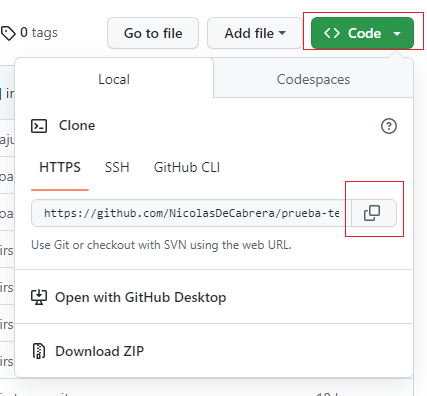
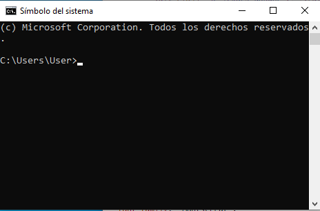
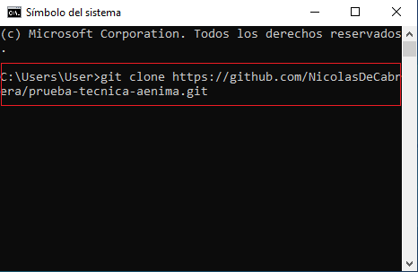
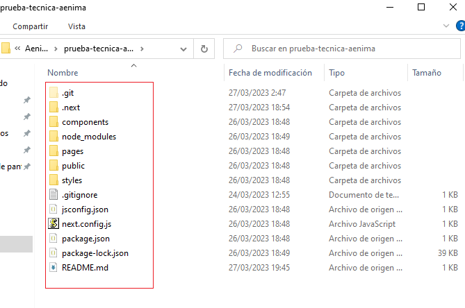
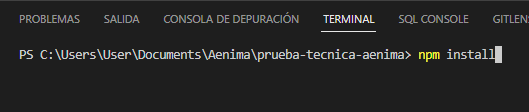
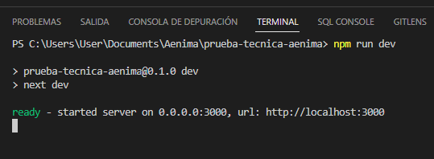

# Prueba Técnica - Front-end

## Clonar repositorio:
#### Has click en el boton Verde `"Code"` y copia el link.

#### Abre una terminal y posicionate en la carpeta donde quieres guardar el proyecto.

#### Una vez posicionado escribe `git clone` mas el link que copiaste y presiona enter.

#### Si todo fue bien deberias ver las carpeta con los archivos dentro de la carpeta que elegiste.

#### En tu editor de codigo abre la carpeta del proyecto.  

## instalacion de dependencias:

#### Abre la terminal del editor de codigo.

#### Escribe `npm install` da enter y espera que se instalen todas las dependencias.

## Iniciar en modo de desarrollo:

#### Escribe `npm run dev` da enter y espera.
#### Una vez iniciado vas a poder acceder desde el navegador con la ruta `http://localhost:3000/`
